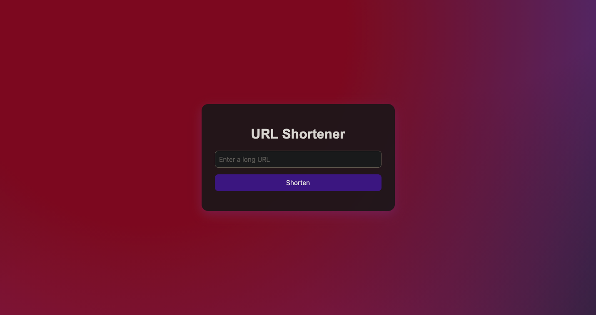
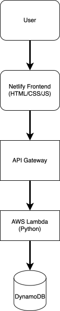

# 🔗 Serverless URL Shortener

A lightweight URL shortener built with **AWS Lambda**, **DynamoDB**, and **Netlify**. Paste a long URL, get a short one — just like that.

**Live Demo**: [t-9.cc](https://t-9.cc)  
**Repo**: [jakoballen/UrlShortener](https://github.com/jakoballen/UrlShortener)

---

## 🚀 Tech Stack

- **Frontend Hosting**: Netlify
- **Redirect Handling**: Netlify Edge Functions
- **Backend Logic**: AWS Lambda
- **API Layer**: AWS API Gateway
- **Database**: AWS DynamoDB
- **Languages**: JavaScript (Node.js)

---

## 📦 Features

- Generate short links for long URLs
- Serverless architecture with Netlify, AWS Lambda, API Gateway, and DynamoDB
- Persistent link storage using DynamoDB with 14-day expiry
- Redirect handling through Netlify Edge Functions
- Deployed with GitHub and Netlify CI/CD

---

## 📸 Application Screenshot



A simple web interface for creating short URLs and copying them to the clipboard.

---

## 🏗️ Architecture

<p align="center">
  
</p>

---

## 📂 Project Structure

```bash
.
├── index.html               # Main frontend UI
├── script.js                # Frontend logic for submitting URLs
├── netlify.toml             # Netlify config for redirects and edge functions
├── package.json             # Project metadata and dependencies
├── package-lock.json
├── screenshots/
│   ├── screenshot.png       # Application screenshot
│   └── diagram.svg          # Architecture diagram
├── netlify/
│   ├── edge-functions/
│   │   ├── redirect.js      # Edge function handling redirects from short URLs
│   │   └── manifest.json    # Netlify edge function manifest
│   └── functions/
│       └── shorten.js       # Serverless function to create new short URLs
└── README.md
```
